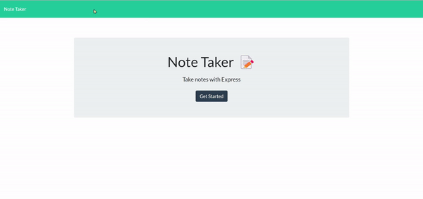

# note-taker

## Technology Used
- html - given by bootcamp
- css - given by bootcamp
- javascript - partially given by bootcamp
- node js
- express js
- [ezgif](https://ezgif.com/): to convert a screen recording to gif file for demo listed here.

## Description 
This is a product of a challenge provided by UC Berkeley Extension Coding Bootcamp

This is for taking a note for future reference.
This is for the user to organize their notes online

This was done while trying to accomplish following criteria:

### Acceptance Criteria
    GIVEN a note-taking application
    WHEN I open the Note Taker
    THEN I am presented with a landing page with a link to a notes page
    WHEN I click on the link to the notes page
    THEN I am presented with a page with existing notes listed in the left-hand column, plus empty fields to enter a new note title and the note’s text in the right-hand column
    WHEN I enter a new note title and the note’s text
    THEN a Save icon appears in the navigation at the top of the page
    WHEN I click on the Save icon
    THEN the new note I have entered is saved and appears in the left-hand column with the other existing notes
    WHEN I click on an existing note in the list in the left-hand column
    THEN that note appears in the right-hand column
    WHEN I click on the Write icon in the navigation at the top of the page
    THEN I am presented with empty fields to enter a new note title and the note’s text in the right-hand column


### Deployed Website (Heroku)
[Deployed Website](https://peaceful-brook-16551-0edcd3871dbf.herokuapp.com/)


## Table of Contents


* [Installation](#installation)
* [Usage](#usage)
* [Learning Points](#learning-points)
* [Credits](#credits)
* [License](#license)


## Installation


```
npm i
```


## Usage 

Following is the demo of this app.
The user can write notes or see the previous notes that they wrote. The user can also delete a note by clicking the delete button




## Learning Points
1. Express to use in back end
2. Using uuid package to generate an unique id


## Credits

### June Moon
- Email: moonjunsain@gmail.com
- [Github](https://github.com/moonjunsain)
- [Linkedin](https://www.linkedin.com/in/june-moon-940538280/)


## License

MIT License

---


© 2023 edX Boot Camps LLC. Confidential and Proprietary. All Rights Reserved.